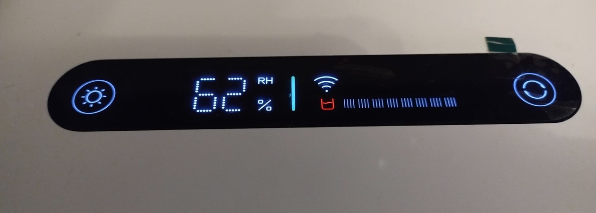
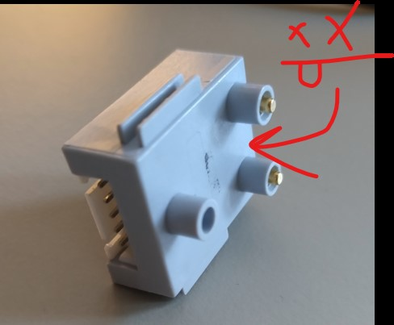
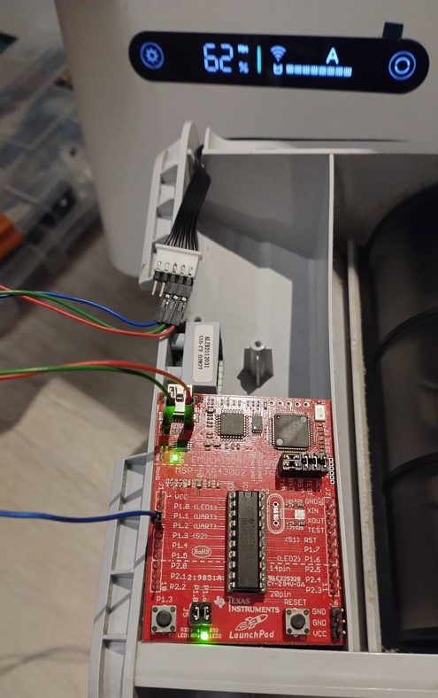
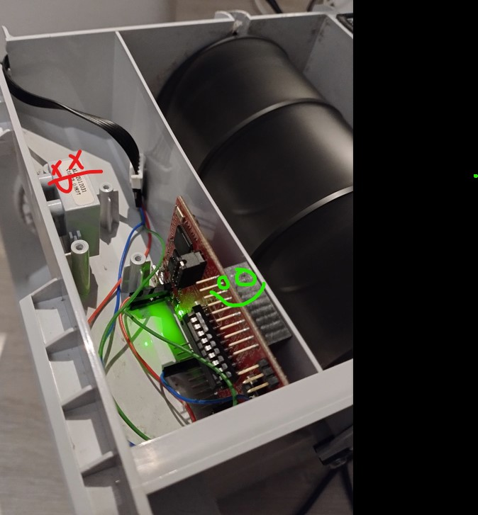

# smartmi-humidifier-2-full-tank
## Override "empty tank" error on Smartmi Humidifier 2 with some old development board you forgot you had in your drawer.

Smartmi shuts down its fan when the water reservoir is empty.

**If you experience empty water reservoir indication even if the water is present this may be due to the pins between the top part and the reservoir part loosing contact. In that case all it takes is to ensure these pins are clean and in contact with each other.** However, if the contact is ensured but the device still indicates empty it’s likely that water got into the top contacts and penetrated where the sensor controller sits. In this case the sensor is toast. 

### Note on disassembly
Its not that hard if you know you have to start by prying on the top cover (where the air vent is). By gently prying around the circumference of the device it eventually let go exposing 4 large attachment screws. Make sure to disconnect the display before taking the innards out.

### The solution
Fortunately some nice people have readily shared their solutions including a reverse engineered message necessary for the humidifier to think that the tank is full
[see humidifierstart repo](https://github.com/tomasvilda/humidifierstart). Thank you Tomas!

### Before you begin
I used the MSP430 - its a very low power microcontroller and runs off 3.3V so if you have a cheaper ARDUINO board definitely take that one as it will be more compatible. You can even attempt to reproduce the full functionality of the sensor controller: [xiaomi-humidifier-water-sensor-digispark](https://github.com/prj/xiaomi-humidifier-water-sensor-digispark)

### Lets do it!
.... However If you have a TI Launch Pad board lying around collecting dust you can just throw it in and connect directly to the harness that used to power up the broken controller:

The only soldering I had to do was adding two pins to the development board PTH's next to the USB connector to power up with the 5V supply provided by the humidifier. (Don’t connect the red wire to board VCC, your 3.3V MSP will not love you for it. TI figured out as much and next revisions of Launch Pad have dedicated 5V and 3.3V pins signed clearly in silkscreen)

The board juust fits in with no murderous modifications necessary.

### NOTE: 
After starting up it can take a few seconds for the humidifier to take note of the messages that our board is sending stubbornly and blindly  toward it. Once it does however, it latches into full tank with no intermittent issues (tested overnight).

Next to the tendency to tip over due to stick rubber feet, and spill all the water next to the electrical wiring sending you, in horror, to your about-to-be-electrocuted children's rescue, the bacteria accumulating in the sensor compartment is this device second largest flaw. So as a bonus feature you can now completely remove the sensor from the water reservoir and give that place a good rinse. You can detach the water sensor by prying with two screwdrivers up by the two sensor water inlets at the bottom of the reservoir. You will see what I mean. Just leave the sensor completely out, make that place easy to clean. You have just improved your device.

### Summary
Yes, your humidifier is a little less smart now but it can do its main job fine for you for many more years instead of ending up as another electro-waste.

Cheers.
